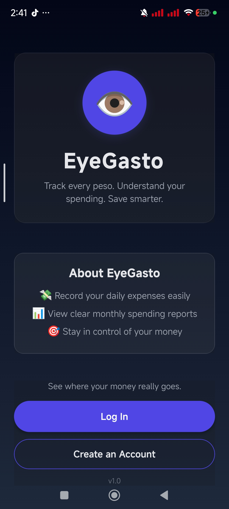
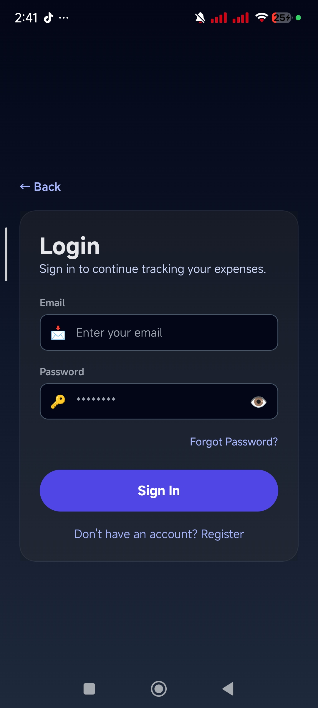
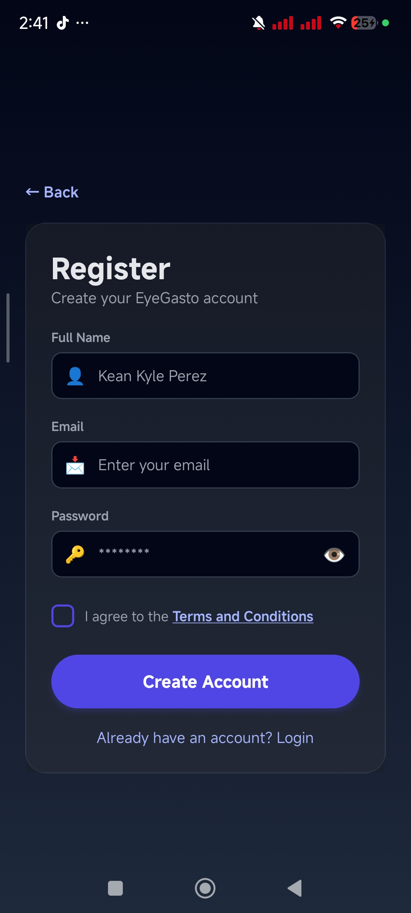
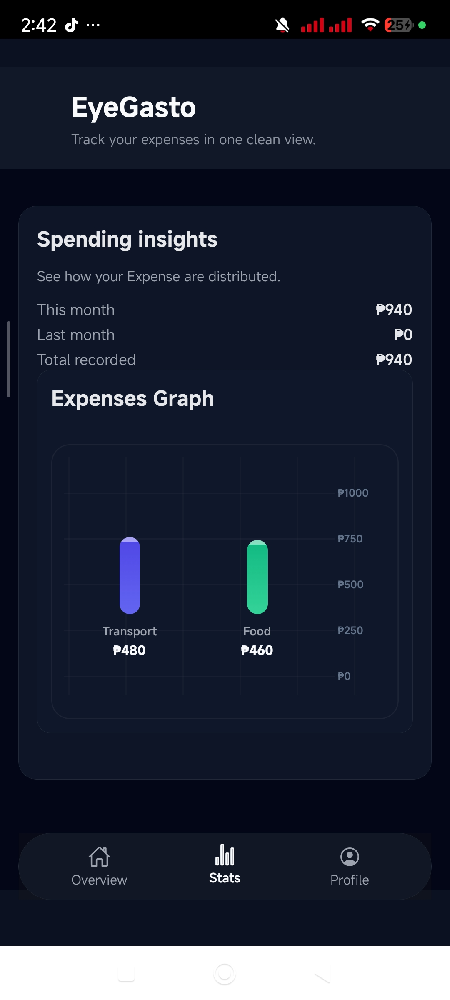
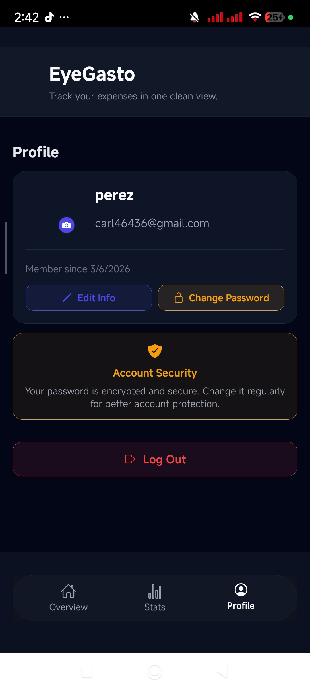

Got it—clean version **without GIF/demo section** 👌

---

# 👁️ EyeGasto Expense Tracker


---

## 👋 Welcome!

**Credits:**

- **CarlDev** for designing and developing the app 🚀

---

## 📱 About EyeGasto

**EyeGasto** is a modern expense tracking mobile app that helps users monitor, manage, and visualize their daily spending. It features a clean UI and real-time tracking for better financial awareness.

---

## ✨ Features

- 💸 Add, edit, and delete expenses
- 📊 Real-time expense tracking and summaries
- 📅 Daily and monthly spending overview
- 🧾 Categorized expenses for better organization
- 🔍 Clean and user-friendly interface
- 🌙 (Optional) Dark mode support

---

## 📸 Screenshots

### 🏠 Home Screen



### 🔐 Log-in Screen



### 📝 Register Screen



### 📊 Stats Screen



### 👤 Profile Screen



## ⚙️ Installation

```bash
# Clone the repository
git clone https://github.com/Carl46436/EyeGastoV2.git

# Navigate to the project folder
cd expense_tracker

# Install dependencies
npm install

# Run the app
npx expo start
```

---

## 🛠 Tech Stack

- **Frontend:** React Native
- **Backend:** Node.js
- **Database:** Supabase

---

## 📂 Project Structure

```
EyeGasto/
├── assets/
├── components/
├── screens/
├── services/
├── App.js
└── package.json
```

---

## 🚀 Future Improvements

- 🔐 User authentication
- ☁️ Cloud sync across devices
- 📈 Advanced analytics & charts
- 💳 Budget planning feature

---

## ⭐ Support

If you like this project, give it a ⭐ on GitHub!

---

If you want, I can also:

- make this **look like a top-tier GitHub project (with header banner + logo)**
- or tailor it for **portfolio/resume use** 🔥
